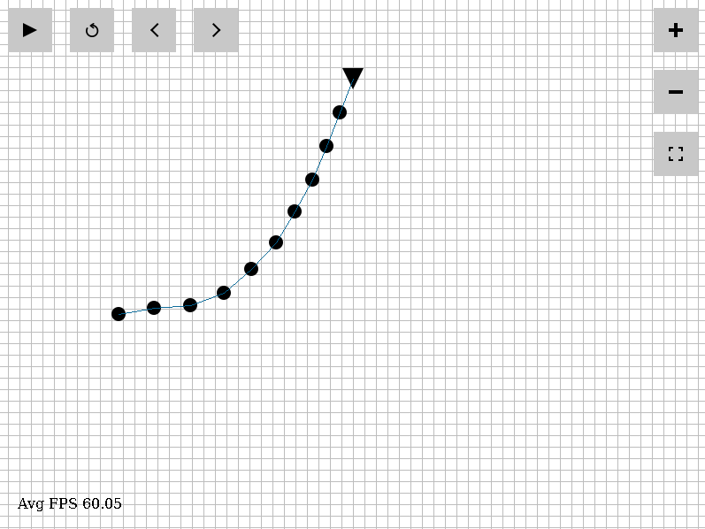
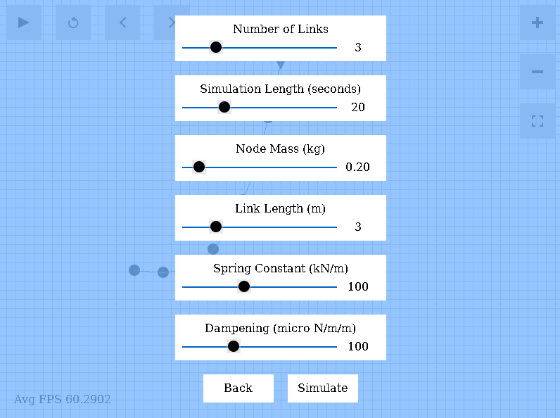

# n-Link Pendulum

A simulation of an n-link pendulum, visualized with SDL2.

The simulation demonstrates the use of the Runge Kutta method for numerical analysis.

### Quickstart

To start the simulation, clone the repository and run the following command
```console
make run
```

You may also be interested in installing the build dependencies (listed below) if you do not already have them.

### Build Dependencies:

* `make`
* `g++`
* `SDL2 SDL2_image SDL2_ttf`

### Interface



### Keyboard Shortcuts

| Command | Keyboard |
| --- | --- |
| Play/Pause | SPACE |
| Play/Pause | K |
| Restart | R |
| Frame Back | ARROW_LEFT |
| Frame Back | J |
| Frame Forward | ARROW_RIGHT |
| Frame Forward | L |
| Zoom In | PLUS |
| Zoom Out | MINUS |
| Zoom to Fit | ZERO |
| Options | ESCAPE |

### Simulation Options

Found in the options menu

* Number of pendulum links
* Simulation time
* Node mass
* Link length
* Spring constant
* Dampening constant


