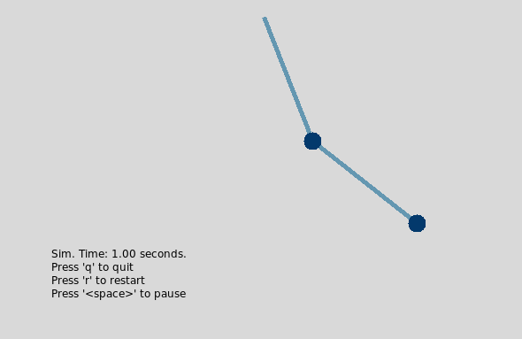
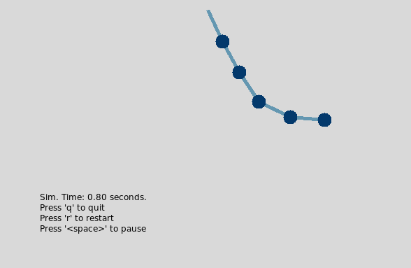

# n-Link Pendulum

A simulation of an n-link pendulum system demonstrating numerical analysis with the Runga Kutta method.

## Overview

The meat and potatoes of the simulation happens in the c++ code.

The c++ function models the pendulum as a series of mass-spring-damper links writes out a binary file of timeseries simulation data. The python script consumes the binary file and plots the simulation data on a tkinter canvas.

Only one timestep (approximately) is held in memory at a time, allowing this simulation/visualization to be extremely memory efficient.

## Screenshots

2-link pendulum



5-link pendulum



## Quickstart

To run and visualize the entire simulation, clone the repository and run
```console
make clean build sim plot
```

Modify simulation parameters such as simulation time or number of links in the c++ `main()` function.

Build dependencies:
  - c++
     - `make, g++`
  - python
    - `python 3`
