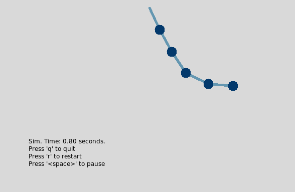

# Posterity

My original one-file rendition of an n-link pendulum simulation, with a one-file rendition of a python visualization.

Perhaps this is worth keeping around as a fun example project.

## Building and Running Everything

### TL;DR

`cd` into this directory and run `make run` in your terminal.

```console
make run
```

### Details and More Options

* `make` will build the executable.
* `make sim` will run the simulation (with a nice progress bar no less). Recompiles if necessary.
* `make run` will launch the plotting window. Recompiles and re-simulates if necessary.

Modify simulation parameters such as simulation time or number of links in the c++ `main()` function.

### Interface



### Build dependencies

* c++: `make, g++`
* python: `python 3`

### Commentary

The meat and potatoes of the simulation happens in the c++ code.

The c++ function models the pendulum as a series of mass-spring-damper links and writes out a binary file of timeseries simulation data. The python script consumes the binary file and plots the simulation data on a tkinter canvas.
